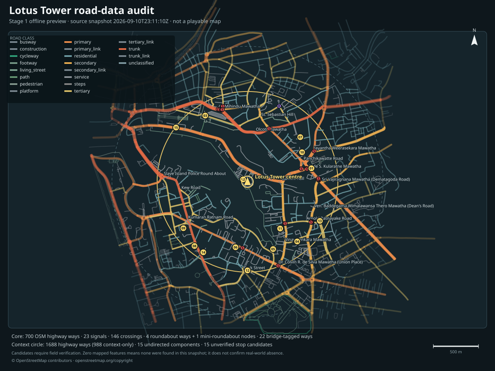

# Colombo Delivery

Colombo Delivery is a planned browser-based 3D driving game built around real
Colombo roads and coordinates. Players collect parcels, navigate to reachable
delivery points, follow traffic rules, and earn money for vehicle upgrades.
Progression begins with a bicycle, continues through an electric bicycle and
motorbikes, and eventually unlocks cars.

Repository: [theetaz/colombo-delivery](https://github.com/theetaz/colombo-delivery)

## Project status

Stage 1 now contains a reproducible OpenStreetMap snapshot, offline road-network
audit, gap inventory, candidate delivery-point screen, and map previews for the
Lotus Tower study area. The audit is a desk review: candidate entrances, bicycle
access, stopping safety, junction details, and current street conditions still
need manual validation. No game runtime has been implemented yet.

Development happens in public. Follow the [roadmap](docs/ROADMAP.md) for planned
stages, the [build timeline](docs/BUILD_TIMELINE.md) for a chronological record
with commit-pinned artifacts, the [development log](docs/DEVELOPMENT_LOG.md) for
verified changes, and the
[main branch commit history](https://github.com/theetaz/colombo-delivery/commits/main)
for the project's implementation record.

The first playable target is a small, recognizable area around Lotus Tower. It
will include a controllable bicycle, 10–20 verified pickup and drop-off points,
one complete timed-delivery loop, saved earnings, and an electric-bicycle
upgrade. The map can then expand through connected areas of Colombo.

## Stage 1 audit preview



*Static overview of the OSM road audit. Candidate markers are graph-screened
test locations and remain unverified for real-world access, stopping, and
safety.*

## Product principles

- Preserve real road geometry, names, directions, junctions, and coordinates
  where source data can be verified.
- Include the local streets needed to connect destinations, even when the main
  focus is on popular roads.
- Make safe driving compatible with delivery deadlines.
- Keep bicycle and motorbike handling approachable with assisted balance.
- Scale to a large browser map by loading nearby city sections and simplifying
  distant scenery.

## Documentation

- [Build timeline](docs/BUILD_TIMELINE.md) records each completed milestone in
  delivery order with immutable links to its artifacts.
- [Roadmap](docs/ROADMAP.md) defines the staged delivery plan and acceptance
  criteria.
- [Architecture](docs/ARCHITECTURE.md) records the proposed technical design
  and the implemented audit pipeline.
- [Lotus Tower map-data audit](docs/MAP_DATA_AUDIT.md) records the study scope,
  reproducible method, results, gaps, and manual verification gates.
- [Data sources](docs/DATA_SOURCES.md) records OSM provenance, tag
  interpretation, attribution, and data-licence handling.
- [Interactive audit map](docs/maps/lotus-tower-road-audit.html) and
  [static audit map](docs/maps/lotus-tower-road-audit.svg) provide offline
  previews of the reviewed layers. They are inspection aids, not gameplay.
- [Development log](docs/DEVELOPMENT_LOG.md) records completed, verifiable
  project changes.

## Reproduce the map audit

Python 3.12 is recommended and is the tested version. The scripts use only the
Python standard library. These commands reproduce the audit and previews from
the committed snapshot without network access:

```sh
python3 scripts/audit_road_network.py
python3 scripts/build_map_preview.py
python3 -m unittest discover -s tests -v
```

Only refresh the live OSM input when intentionally starting a new, separately
reviewed snapshot:

```sh
python3 scripts/fetch_osm_data.py
```

GitHub displays the interactive HTML file as source. Serve the preview locally
from the repository root:

```sh
python3 -m http.server 4173 --bind 127.0.0.1 --directory docs/maps
```

Then open
[http://127.0.0.1:4173/lotus-tower-road-audit.html](http://127.0.0.1:4173/lotus-tower-road-audit.html).

## Next step

Use the audited snapshot to render one small road section in a browser with the
proposed Vite, TypeScript, and Three.js stack. The first slice should expose
camera controls, source and local coordinates, coordinate alignment, and the
exact width evidence or fallback used by every rendered segment. Add the first
controllable bicycle after the road geometry passes this review. Stage 1 access,
entrance, stopping, junction, and current-street checks remain open throughout
the prototype.
