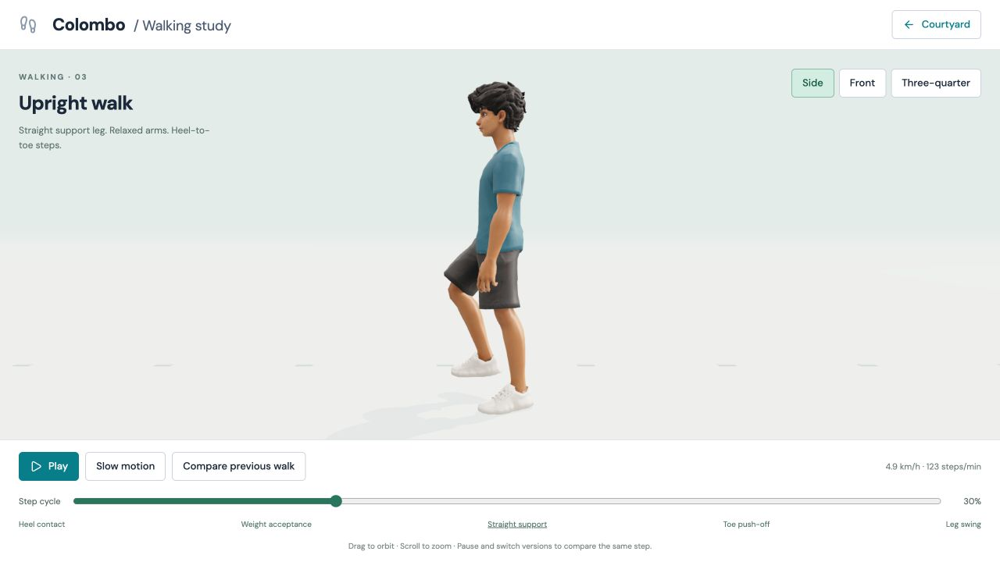
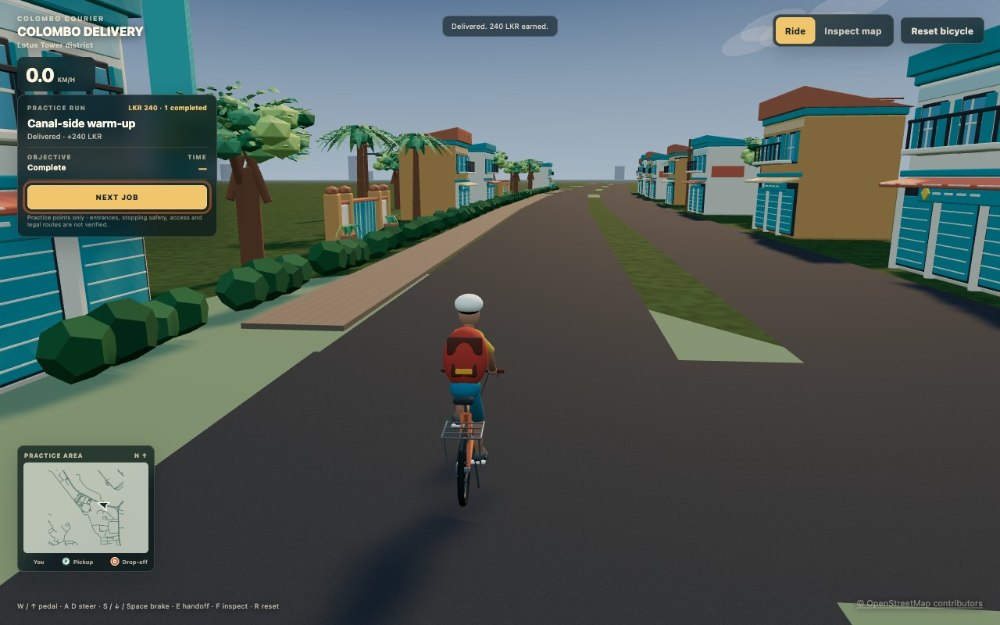

# Colombo Delivery

Colombo Delivery is a browser-based 3D delivery-game project built around real
Colombo roads and coordinates. The long-term progression begins with a bicycle,
continues through electric bicycles and motorbikes, and later adds cars. Work is
currently split between the original playable Lotus Tower prototype and a newer,
standalone first-district study.

Repository: [theetaz/colombo-delivery](https://github.com/theetaz/colombo-delivery)

## Current checkpoint — 15 September 2026

The original app has a controllable bicycle, three generated practice jobs,
locally saved earnings, a north-up practice minimap, and a warm illustrated
900 × 900 m Lotus Tower road slice. These are bounded game prototypes. The
delivery markers and road presentation have not passed the field checks needed
to claim safe or legal real-world routes.

The newer [Colombo road and animation study](studies/colombo-road/README.md) is a
separate 1.8 × 1.8 km geographic and movement package. It contains the district
map, editable Blender scenes, browser assets, a limited one-route car delivery
pilot, a cyclist studio, walking, pedaling, and bicycle mount/dismount previews.
It was consolidated into this repository in
[`80270cb`](https://github.com/theetaz/colombo-delivery/commit/80270cb69b26869f357e6924db0667428cf93ca8)
with all 11 original study commits preserved in history.

Human review approved the study's walking cycle, and the previously approved
pedaling track is preserved unchanged. This does not approve the cyclist study
as final character quality. The revised mounting and dismounting animations are
ready for human testing and are not approved yet.
The study reuses the approved bicycle design with a fitted saddle. Earlier
full-body stationary rider fits and clean-rig checkpoint 1 in the original app
were rejected; later diagnostic experiments did not produce a review candidate.
Those rejected historical prototypes do not describe the newer study's approved
walk. See [stationary rider fit](docs/RIDER_FIT.md) and the
[study movement record](studies/colombo-road/cyclist/MOVEMENT.md).

## Development checkpoints

| Date | Checkpoint | Status and evidence |
| --- | --- | --- |
| 11 Sep | [Project foundation](docs/BUILD_TIMELINE.md#2026-09-11--project-foundation) | Game scope, staged roadmap, browser architecture, and public progress record established. |
| 11 Sep | [Lotus Tower road audit](docs/MAP_DATA_AUDIT.md) | Reproducible OSM desk audit delivered. Field checks for access, entrances, stopping, junctions, and current conditions remain open. |
| 11 Sep | [First 3D road prototype](docs/ROAD_PROTOTYPE.md) | 109 saved OSM ways rendered in an inspectable 900 × 900 m Three.js slice. |
| 11 Sep | [First controllable bicycle](docs/BICYCLE_PROTOTYPE.md) | Assisted bicycle controls, camera, surface handling, collisions, and reset added to the road slice. |
| 13 Sep | [Practice delivery loop](docs/DELIVERY_PROTOTYPE.md) | Three generated timed jobs, pickup/drop-off gates, rewards, and local aggregate progress implemented; published with the prototype-art checkpoints in [`c4f013d`](https://github.com/theetaz/colombo-delivery/commit/c4f013dabdf1cd815e9f22492cb4b05efa9c8c18). |
| 13 Sep | [Environment and minimap](docs/VISUAL_PROTOTYPE.md) | Warm illustrated scenery, compact HUD, street-quality pass, and [practice minimap](docs/MINIMAP_PROTOTYPE.md) added and browser reviewed. |
| 13 Sep | [Teenage courier character](docs/CHARACTER_ART_PIPELINE.md) | Original 2D concept, textured 3D reconstruction, Blender cleanup, and standing-character review followed the earlier [courier-detail study](docs/CHARACTER_STUDY.md). Appearance review did not establish riding deformation quality. |
| 13 Sep | [Customization and garment fit](docs/CHARACTER_CUSTOMIZATION.md) | 23-choice Courier Studio, skin and outfit colors, optional accessories, saved looks, and successive full-length trouser refinements implemented as a static wardrobe preview. |
| 13 Sep | [Backpack and animated rider](docs/RIDER_EQUIPMENT.md) | Insulated delivery backpack and a playable bicycle-rider prototype added; it remained a technical prototype rather than the target hero quality. |
| 13 Sep | [Standalone commuter bicycle](docs/BICYCLE_REBUILD.md) | Bicycle-only model human-approved at frozen GLB hash; subsequent stationary rider fits were reviewed separately and rejected. |
| 14 Sep | [Rider source audit](docs/BUILD_TIMELINE.md#2026-09-14--clean-rig-revision-2-repair-and-source-audit) | Rejected rigs and deformation evidence preserved; the audit corrected the construction history. Revision 2 failed engineering bounds and was not sent for human review. |
| 15 Sep | [First-district study baseline](docs/BUILD_TIMELINE.md#2026-09-15--standalone-study-baseline-preserved) | Standalone 1.8 × 1.8 km map from a 14 September OSM snapshot, review viewer, limited car delivery pilot, cyclist asset, and movement testbed preserved. |
| 15 Sep | [Walking approval](studies/colombo-road/docs/visual-history/2026-09-15-walk-approved/README.md) | Upright gait refined through planted contacts, momentum handoffs, smooth curves, and removal of repeated pelvis/knee motion; human-approved result preserved. |
| 15 Sep | [Bicycle transitions](studies/colombo-road/cyclist/TRANSITIONS.md) | Reference-guided mount/dismount sequences added and leg paths corrected while preserving the approved walking and pedaling tracks; human testing remains pending. |
| 15 Sep | [Study consolidation](docs/BUILD_TIMELINE.md#2026-09-15--colombo-road-and-movement-study-consolidated) | Map data, Blender sources, browser assets, tests, 37 milestone captures, and original commit history moved into this repository. |

The [build timeline](docs/BUILD_TIMELINE.md) provides the full chronological
record and commit-pinned artifacts. The [development log](docs/DEVELOPMENT_LOG.md)
records detailed verified changes, and the
[main branch history](https://github.com/theetaz/colombo-delivery/commits/main)
is the public implementation record.

## Preview the first-district study

Use Node.js 24 or newer and npm 11 or newer for the repository commands. Run
these from the repository root:

```sh
npm run study:install
npm run study:dev
```

Open these local pages:

- [Map and limited car-delivery pilot](http://127.0.0.1:5175/#drive)
- [Walk and ride courtyard](http://127.0.0.1:5175/movement.html)
- [Bicycle transition review](http://127.0.0.1:5175/transitions.html)
- [Walking review](http://127.0.0.1:5175/walking.html)
- [Cyclist studio](http://127.0.0.1:5175/cyclist.html)

The [viewer guide](studies/colombo-road/viewer/README.md) explains every preview
and its controls. Validate the standalone study with:

```sh
npm run study:test
npm run study:build
```

The car pilot covers one 580 m corridor and one fictional collection/delivery
pair. It is a local arcade test, not a fleet unlock, complete routing system, or
integration of the district into the original app.

## Run the original bicycle game prototype

Use Node.js 24 or newer and npm 11 or newer:

```sh
npm ci
npm run dev -- --host 127.0.0.1 --port 5173
```

Open [http://127.0.0.1:5173/](http://127.0.0.1:5173/). Ride with `W` or the up
arrow, steer with `A` / `D` or the arrow keys, brake with `S`, the down arrow, or
space, press `R` to reset, and press `F` to switch to the map inspector. Select
**Accept job** or press `E` to start a practice delivery, then use the same
action while stopped inside its generated pickup and drop-off markers.

Build and verify the original app with:

```sh
npm run typecheck
npm test
npm run build
npm run preview -- --host 127.0.0.1 --port 5174
```

The browser scene reads the committed offline road artifact and does not fetch
live map data.

## Visual record

[](studies/colombo-road/docs/visual-history/2026-09-15-walk-approved/README.md)

*The approved walking checkpoint is preserved separately from the later,
still-pending bicycle transition review.*

[](docs/DELIVERY_PROTOTYPE.md)

*The original app after completing its first generated practice job with the
polished courier bicycle and rider prototype.*

[](docs/MAP_DATA_AUDIT.md)

*The Stage 1 OSM desk audit. Candidate markers remain unverified for real-world
access, stopping, and safety.*

The [study screenshot timeline](studies/colombo-road/docs/visual-history/README.md)
preserves 37 browser captures across approved walking, the initial bicycle
transition study, and the corrected leg-motion pass.

## Reproduce the original map audit

Python 3.12 is recommended and is the tested version. The scripts use only the
standard library and reproduce the committed snapshot without network access:

```sh
python3 scripts/audit_road_network.py
python3 scripts/build_map_preview.py
python3 -m unittest discover -s tests -v
```

Only refresh the live OSM input when intentionally beginning a new, separately
reviewed snapshot:

```sh
python3 scripts/fetch_osm_data.py
```

Serve the interactive audit preview locally with:

```sh
python3 -m http.server 4173 --bind 127.0.0.1 --directory docs/maps
```

Then open
[http://127.0.0.1:4173/lotus-tower-road-audit.html](http://127.0.0.1:4173/lotus-tower-road-audit.html).

## Project principles

- Preserve real road geometry, names, directions, junctions, and coordinates
  where source data can be verified.
- Keep generated practice stops distinct from verified delivery destinations.
- Make safe driving compatible with delivery deadlines.
- Keep bicycle and motorbike handling approachable with assisted balance.
- Scale the browser map by loading nearby city sections and simplifying distant
  scenery.

## Documentation guide

- [Roadmap](docs/ROADMAP.md) — staged plan and acceptance criteria.
- [Architecture](docs/ARCHITECTURE.md) — technical design and implemented
  audit, rendering, and bicycle-control pipeline.
- [Build timeline](docs/BUILD_TIMELINE.md) — chronological public checkpoints
  with commit-pinned evidence.
- [Development log](docs/DEVELOPMENT_LOG.md) — detailed verified change record.
- [Colombo road study](studies/colombo-road/README.md) — standalone district
  asset, source limitations, provenance, and rebuild commands.
- [Study viewer](studies/colombo-road/viewer/README.md) — map, delivery, cyclist,
  walking, and transition previews.
- [Character art pipeline](docs/CHARACTER_ART_PIPELINE.md) — hero-character
  direction, reconstruction stages, and remaining rights/review gates.
- [Vehicles and progression](docs/VEHICLES.md) — implemented bicycle contract
  and planned vehicle roles.
- [Data sources](docs/DATA_SOURCES.md) — OSM provenance, interpretation,
  attribution, and licence handling.

## Next checkpoints

The immediate review gate is human testing of the corrected mount/dismount
sequences. The standalone district still needs street-level accuracy review,
bridge and lane refinement, routing rules, collisions, traffic, and integration
before it can become city gameplay. The original practice loop still needs
verified pickup/drop-off locations and the Stage 1 field checks before its
markers can represent real delivery stops.
