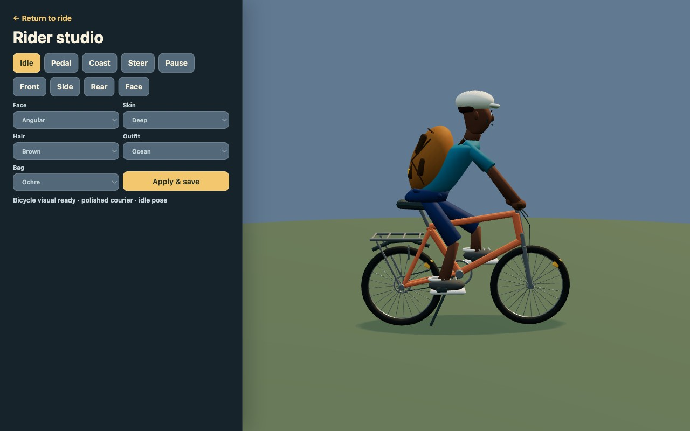
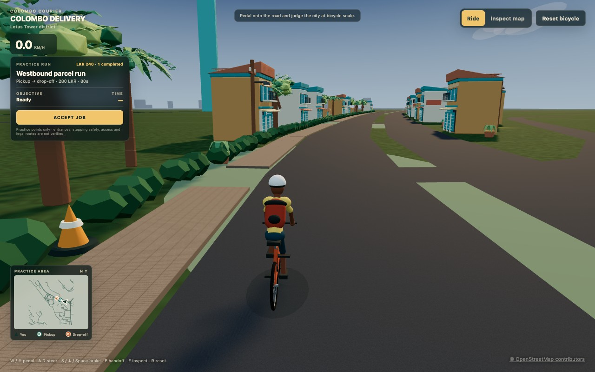
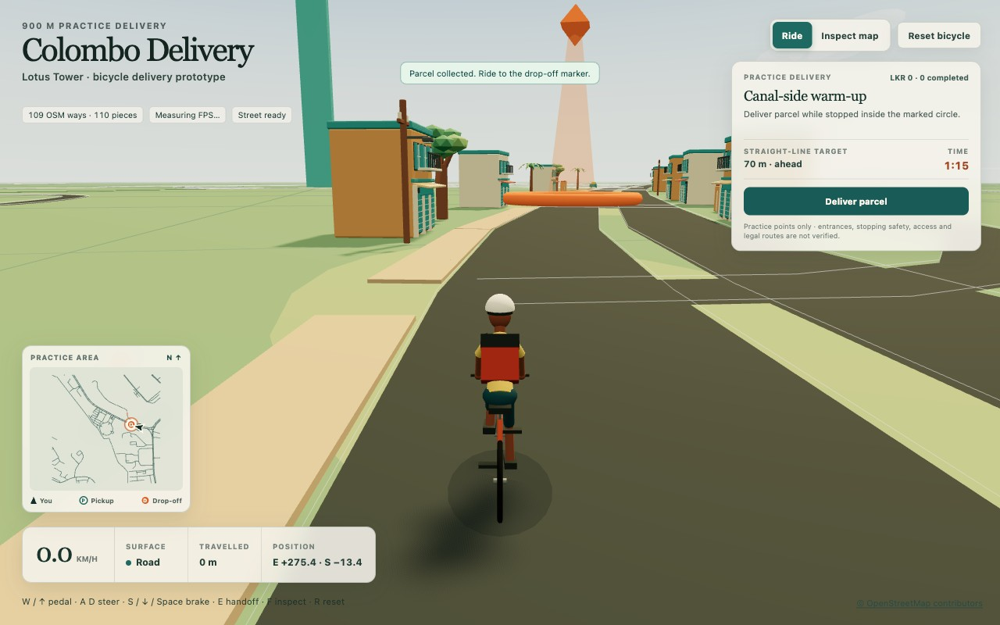
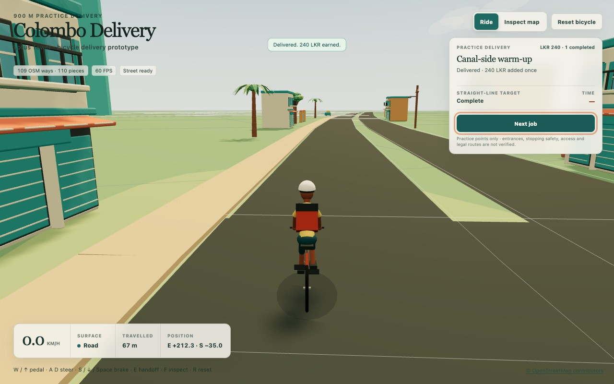
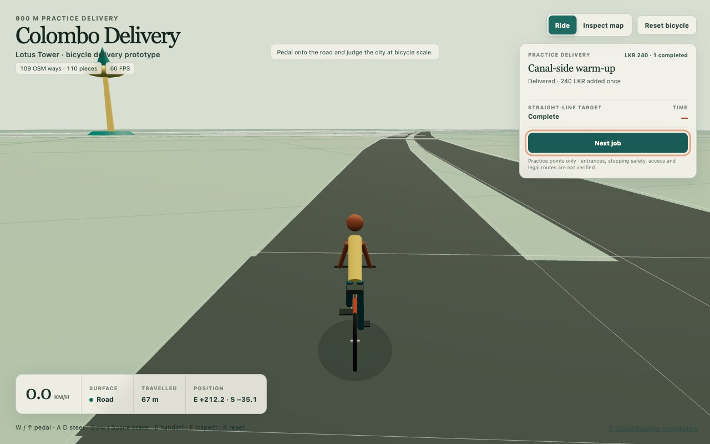

# Colombo Delivery

Colombo Delivery is a planned browser-based 3D driving game built around real
Colombo roads and coordinates. Players collect parcels, navigate to reachable
delivery points, follow traffic rules, and earn money for vehicle upgrades.
Progression begins with a bicycle, continues through an electric bicycle and
motorbikes, and eventually unlocks cars.

Repository: [theetaz/colombo-delivery](https://github.com/theetaz/colombo-delivery)

## Project status

The repository now contains the reproducible Stage 1 OpenStreetMap audit, a
browser-rendered 3D road prototype, the first controllable bicycle, a bounded
three-job practice delivery loop, and a warm illustrated visual slice. The
bicycle uses approachable custom kinematics on the same 900 × 900 m Lotus Tower
slice, with pedal, coast, brake, steer, a following camera, road and grass
handling, marked training obstacles, world-boundary collisions, and reset. The
practice loop adds timed pickup and drop-off actions, three fixed rewards, and
locally saved aggregate earnings and completions. The visual slice adds a
reproducible ten-piece Blender asset kit, a dense 250 m roadside vignette, an
isolated art preview, and a clearer rider silhouette. The original source inspector
remains available. Its markers are generated practice stops; candidate
entrances, bicycle access, stopping safety, route legality, junction details,
and current street conditions still need manual validation.

Ride mode also contains a compact north-up practice minimap drawn from the
same saved road slice. It follows the bicycle's live position and heading and
changes pickup and drop-off emphasis with the delivery phase. It is an
orientation aid, not legal routing; its generated markers remain unverified
practice locations.

The current checkout includes a follow-up street-quality pass with richer
project-authored asset detail, lightweight procedural road and ground surfaces,
an early-evening scene treatment, and a compact dark game HUD. Its scope,
provenance, reference gap, and reviewed production evidence are recorded in the
[street quality study](docs/STREET_QUALITY_STUDY.md).

The [vehicle and progression plan](docs/VEHICLES.md) defines distinct roles for
the implemented bicycle and the planned electric bicycle, scooters, motorbikes,
car, and van. Only bicycle gameplay exists today; future vehicles, prices,
running costs, capacities, upgrades, and garage unlocks remain planned.
The [courier character study](docs/CHARACTER_STUDY.md) records the implemented
detail, limited preset appearance choices, material isolation, persistence,
and production review without adding another playable character or changing
bicycle behavior.

## Courier character detail

[](docs/CHARACTER_STUDY.md)

*The reviewed Rider studio shows the detailed project-authored courier and its
limited face and palette choices. The [character study](docs/CHARACTER_STUDY.md)
records the asset and texture provenance, browser persistence, per-instance
material isolation, responsive production checks, failure fallback, and the
remaining rigid-part animation limits. This is a preserved technical prototype,
not the target hero-character quality.*

The next [teenage courier character pipeline](docs/CHARACTER_ART_PIPELINE.md)
starts from an original 2D identity and requires genuine 3D reconstruction,
Blender cleanup and retopology, a skinned rig, facial blend shapes, and verified
skin, shirt, and shoe customization before it can replace that prototype. The
current `character-preview.html` inspection route shows the static reconstructed
cleanup and its separated skin, shirt, and shoe material regions; it is not yet
the game rider.

## Polished courier bicycle

[](docs/VEHICLES.md)

*The reviewed 1280 × 800 Ride frame shows the Blender-authored courier bicycle
and rider after completing the first practice job. The
[vehicle document](docs/VEHICLES.md) records its measured asset contract,
contact-driven animation, procedural fallback, isolated preview, responsive
browser validation, and the planned fleet roles. The electric bicycle,
scooters, motorbikes, car, and van remain plans rather than available vehicles.*

## Street quality study

[](docs/STREET_QUALITY_STUDY.md)

*The reviewed 1280 × 800 Ride view shows the compact game HUD, textured street,
denser original scenery, revised rider, and early-evening lighting. The
[street quality study](docs/STREET_QUALITY_STUDY.md) records its original asset
pipeline, browser validation, performance smoke sample, responsive frame, and
remaining gap to the supplied reference.*

Development happens in public. Follow the [roadmap](docs/ROADMAP.md) for planned
stages, the [build timeline](docs/BUILD_TIMELINE.md) for a chronological record
with commit-pinned artifacts, the [development log](docs/DEVELOPMENT_LOG.md) for
verified changes, and the
[main branch commit history](https://github.com/theetaz/colombo-delivery/commits/main)
for the project's implementation record.

The first playable target is a small, recognizable area around Lotus Tower. It
will include a controllable bicycle, 10–20 verified pickup and drop-off points,
one complete timed-delivery loop, saved earnings, and an electric-bicycle
upgrade. The map can then expand through connected areas of Colombo.

## North-up practice minimap

[](docs/MINIMAP_PROTOTYPE.md)

*The reviewed 1280 × 800 production Ride view shows the bicycle heading and
active drop-off over the same saved road slice as the 3D world. The
[minimap prototype report](docs/MINIMAP_PROTOTYPE.md) records its projection,
delivery phases, responsive behaviour, validation, and strict practice-only
limits.*

## Warm illustrated visual prototype

[](docs/VISUAL_PROTOTYPE.md)

*The reviewed 1280 × 800 production Ride view shows the denser 250 m street
vignette, full-scale Lotus Tower at the mapped origin, revised rider, paved
footway treatment, and delivery interface. The
[visual prototype report](docs/VISUAL_PROTOTYPE.md) records the asset pipeline,
placement contract, provenance, build measurements, validation, and remaining
art and performance work.*

## Bounded practice delivery loop

[](docs/DELIVERY_PROTOTYPE.md)

*The 1280 × 800 production Ride view shows the first practice job completed,
with LKR 240 and one completion saved. Open the
[delivery prototype report](docs/DELIVERY_PROTOTYPE.md) for the exact jobs,
controls, generated coordinates, timer, pause and reset rules, storage contract,
validation, and limitations.*

## First controllable bicycle prototype

[](docs/BICYCLE_PROTOTYPE.md)

*The 1280 × 800 production Ride view shows the first assisted procedural
bicycle at its saved road spawn with the following camera, speed and surface
feedback, grass slowdown, marked training obstacles, and reset. Open the
[bicycle prototype report](docs/BICYCLE_PROTOTYPE.md) for its exact controls,
spawn coordinates, tuning, collision model, validation, and limitations.*

## First 3D road prototype

[](docs/ROAD_PROTOTYPE.md)

*The first production road scene renders 109 saved OSM ways and exposes the
coordinate, width, and vertical-placement evidence behind each selectable
surface. Open the [prototype report](docs/ROAD_PROTOTYPE.md) for its exact scope,
controls, validation, and limitations.*

## Stage 1 audit preview


*Static overview of the OSM road audit. Candidate markers are graph-screened
test locations and remain unverified for real-world access, stopping, and
safety.*

## Product principles

- Preserve real road geometry, names, directions, junctions, and coordinates
  where source data can be verified.
- Include the local streets needed to connect destinations, even when the main
  focus is on popular roads.
- Make safe driving compatible with delivery deadlines.
- Keep bicycle and motorbike handling approachable with assisted balance.
- Scale to a large browser map by loading nearby city sections and simplifying
  distant scenery.

## Documentation

- [Build timeline](docs/BUILD_TIMELINE.md) records each completed milestone in
  delivery order with immutable links to its artifacts.
- [Roadmap](docs/ROADMAP.md) defines the staged delivery plan and acceptance
  criteria.
- [Architecture](docs/ARCHITECTURE.md) records the proposed technical design
  and the implemented audit, road-rendering, and bicycle-control pipeline.
- [First 3D road prototype](docs/ROAD_PROTOTYPE.md) records its exact scope,
  source contract, coordinate system, rendering assumptions, controls,
  validation, and limitations.
- [First controllable bicycle prototype](docs/BICYCLE_PROTOTYPE.md) records the
  exact spawn, controls, assisted handling constants, camera, surface and
  collision rules, validation, and limitations.
- [Bounded practice delivery loop](docs/DELIVERY_PROTOTYPE.md) records the
  three-job sequence, stop interaction, timer, pause and reset rules, browser
  storage contract, validation, and limits.
- [Warm illustrated visual prototype](docs/VISUAL_PROTOTYPE.md) records the
  palette, scale, placement, inspiration, asset provenance, and review gates
  for the bounded scenery and rider study.
- [North-up practice minimap](docs/MINIMAP_PROTOTYPE.md) records the shared road
  data contract, live bicycle heading, phase-aware practice markers, responsive
  review gates, and routing limitations.
- [Street quality study](docs/STREET_QUALITY_STUDY.md) records the follow-up
  environment, surface, lighting, and compact-HUD pass and its remaining gap to
  the supplied quality reference.
- [Vehicles and progression](docs/VEHICLES.md) records the shared asset contract,
  fleet roles, cargo and running-cost direction, upgrade principles, and the
  validation gates required before planned vehicles enter the game.
- [Courier character study](docs/CHARACTER_STUDY.md) records the rider-detail,
  appearance, material-isolation, persistence, and review contract.
- [Teenage courier character pipeline](docs/CHARACTER_ART_PIPELINE.md) records
  the corrected hero-character brief, production stages, browser review gates,
  and current preproduction status.
- [Lotus Tower map-data audit](docs/MAP_DATA_AUDIT.md) records the study scope,
  reproducible method, results, gaps, and manual verification gates.
- [Data sources](docs/DATA_SOURCES.md) records OSM provenance, tag
  interpretation, attribution, and data-licence handling.
- [Interactive audit map](docs/maps/lotus-tower-road-audit.html) and
  [static audit map](docs/maps/lotus-tower-road-audit.svg) provide offline
  previews of the reviewed layers. They are inspection aids, not gameplay.
- [Development log](docs/DEVELOPMENT_LOG.md) records completed, verifiable
  project changes.

## Reproduce the map audit

Python 3.12 is recommended and is the tested version. The scripts use only the
Python standard library. These commands reproduce the audit and previews from
the committed snapshot without network access:

```sh
python3 scripts/audit_road_network.py
python3 scripts/build_map_preview.py
python3 -m unittest discover -s tests -v
```

Only refresh the live OSM input when intentionally starting a new, separately
reviewed snapshot:

```sh
python3 scripts/fetch_osm_data.py
```

GitHub displays the interactive HTML file as source. Serve the preview locally
from the repository root:

```sh
python3 -m http.server 4173 --bind 127.0.0.1 --directory docs/maps
```

Then open
[http://127.0.0.1:4173/lotus-tower-road-audit.html](http://127.0.0.1:4173/lotus-tower-road-audit.html).

## Run the bicycle and road prototype

Use Node.js 24 or newer and npm 11 or newer:

```sh
npm ci
npm run dev -- --host 127.0.0.1 --port 5173
```

Open [http://127.0.0.1:5173/](http://127.0.0.1:5173/). Build and verify the
prototype with:

```sh
npm run typecheck
npm test
npm run build
npm run preview -- --host 127.0.0.1 --port 5174
```

The browser scene uses the committed offline road artifact and does not fetch
live map data. Ride with `W` or the up arrow, steer with `A` / `D` or the arrow
keys, brake with `S`, the down arrow, or space, press `R` to reset, and press
`F` to switch to the preserved map inspector. See the
[bicycle report](docs/BICYCLE_PROTOTYPE.md) for the handling model and the
[road report](docs/ROAD_PROTOTYPE.md) for the 900 × 900 m geometry scope and
provisional width and elevation rules. In Ride mode, select **Accept job** or
press `E` to start a practice delivery, then use the same action while stopped
inside its pickup and drop-off markers. The
[delivery report](docs/DELIVERY_PROTOTYPE.md) records the complete interaction,
timer, reset, and storage rules.

## Next step

Continue art polish and measure the bounded warm illustrated slice across
representative hardware and longer rides. The pending practice-loop checks
still include timeout and retry, reset cancellation, sustained keyboard control
on a physical device, physical multi-touch, and marked-obstacle contact. Stage 1 access,
entrance, stopping, junction, route, and current-street checks remain open; the
practice markers, straight-line guidance, and minimap do not satisfy them.
