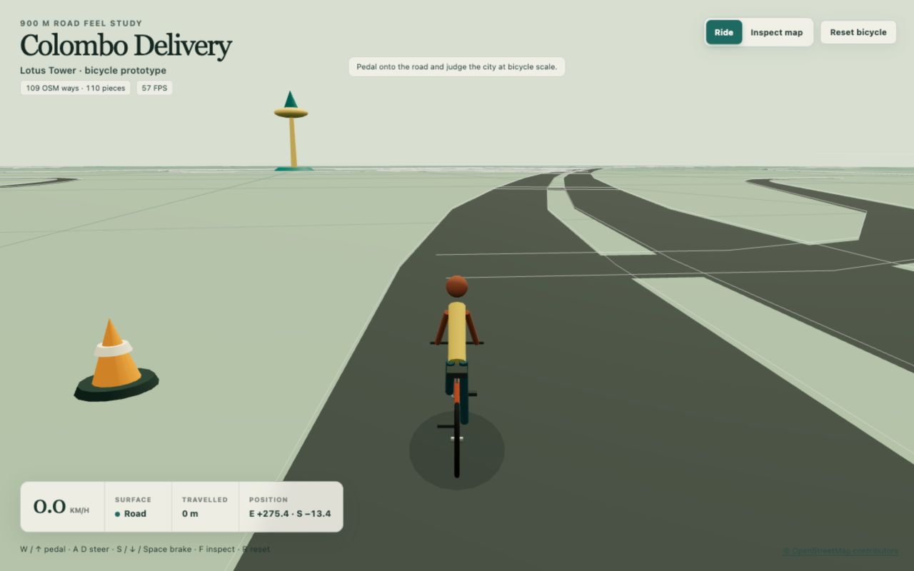

# First Controllable Bicycle Prototype

## Purpose and status

This prototype adds the first rideable vehicle to the existing 900 × 900 m
Lotus Tower road scene. It is a focused test of road scale, bicycle feel,
following-camera behaviour, basic collisions, and recovery. The road scene and
its source inspector remain available so riding impressions can be compared
with the same coordinate and geometry evidence used by the earlier road
prototype.

The bicycle uses assisted custom kinematics rather than a rigid-body physics
engine. This keeps the first handling experiment small enough to tune from
direct rider feedback before the project commits to a broader vehicle-physics
architecture.

## Production preview



*The 1280 × 800 production build stopped in Ride mode at the saved source-road
spawn. The procedural bicycle and rider, following camera, road surface, ride
status, and a marked training obstacle make the scale and handling experiment
visible without requiring an external 3D asset pipeline.*

## Reproduce the prototype

The supported toolchain is Node.js 24 or newer and npm 11 or newer. Install the
locked dependencies, then start the local server:

```sh
npm ci
npm run dev -- --host 127.0.0.1 --port 5173
```

Open [http://127.0.0.1:5173/](http://127.0.0.1:5173/). The production build and
automated checks use:

```sh
npm run typecheck
npm test
npm run build
npm run preview -- --host 127.0.0.1 --port 5174
```

After building, the last command serves the production output at
[http://127.0.0.1:5174/](http://127.0.0.1:5174/). The browser continues to read
the committed road artifact without a live OpenStreetMap request.

## Controls and interface modes

Ride mode starts with a following camera and the bicycle stopped at its saved
training position.

| Action | Keyboard | On-screen control |
| --- | --- | --- |
| Pedal | `W` or up arrow | Pedal |
| Steer | `A` / `D` or left / right arrows | Left / right |
| Brake | `S`, down arrow, or space | Brake |
| Switch between Ride and Inspect map | `F` | Ride / Inspect map |
| Return to the training start | `R` | Reset bicycle |

Releasing the pedal coasts. Braking reduces forward speed to zero; this
prototype has no reverse gear. Ride mode reports speed, surface, distance
travelled, and local east/south position. It also reports transitions between
road and grass and contact with a training marker or the study boundary.

Inspect map pauses the bicycle, clears held ride inputs, and restores the
earlier orbit, right-drag pan, zoom, road selection, source inspector, camera
buttons, and layer toggles. Returning to Ride mode restores the following
camera at the bicycle's current position. Losing browser focus or moving focus
into an editable control clears held ride inputs.

## Spawn and coordinate contract

The spawn is derived from D. R. Wijewardene Mawatha, saved OpenStreetMap way
`13884292`. It is placed 70 m along the clipped source direction and 1.5 m to
the left of that direction. The source way is mapped `oneway=yes`, but the
placement is only a repeatable training start; it does not establish current
bicycle access or route legality.

| Field | Value |
| --- | ---: |
| Source feature | `way/13884292` |
| Longitude | 79.86080957499048 |
| Latitude | 6.927147093685909 |
| Local east `x` | 275.37068363728685 m |
| Local elevation `y` | 0 m |
| Local south `z` | −13.41014759519771 m |
| Heading | −1.3479130479067791 radians |

A zero heading points north along `−z`; positive heading turns clockwise
toward east along `+x`. The saved WGS84 position projects back to the local
spawn within approximately 0.00000000323 m in the verified calculation. The
spawn lies inside a rendered ground-road triangle.

Two orange practice bollards sit on grass to the left of the spawn while the
road remains open:

| Obstacle | Local east `x` | Local south `z` | Collision radius |
| --- | ---: | ---: | ---: |
| Practice bollard 1 | 276.45981555230304 m | −8.036481093479061 m | 0.55 m |
| Practice bollard 2 | 272.0711267563543 m | −9.031172328141409 m | 0.55 m |

## Assisted handling model

The simulation advances in fixed 1/120 s steps. The controller API accepts at
most 0.25 s per call and records any excess as dropped time rather than causing
an unbounded catch-up. The browser scene applies a tighter 0.1 s frame-delta
cap before calling the controller. The current tuning is deliberately exposed
as a prototype baseline:

| Parameter | Value |
| --- | ---: |
| Maximum road speed | 8.333333 m/s (30 km/h) |
| Maximum grass speed | 3.333333 m/s (12 km/h) |
| Pedal acceleration | 2.4 m/s² |
| Brake deceleration | 7 m/s² |
| Rolling deceleration | 0.32 m/s² |
| Aerodynamic deceleration | `0.018 × speed²` m/s² |
| Additional grass deceleration | 1.1 m/s² |
| Steering input response | 4.8 per second |
| Steering return | 6.5 per second |
| Maximum steer angle | 0.5 radians |
| Bicycle wheelbase | 1.1 m |
| Maximum turn rate | 1.75 radians/s |
| Minimum speed for heading change | 0.2 m/s |

Steering is assisted: input approaches a normalized left or right target and
returns to centre after release. A bicycle-style wheelbase calculation turns
the heading only while moving, with a turn-rate limit for control. The visual
front wheel steers, the wheels and crank rotate with travel, and the following
camera smooths its position and aim behind the bicycle. Its desired position is
5.9 m behind and 3.15 m above the bicycle, with up to 0.35 m of extra lift from
speed; it looks 4.2 m ahead. Position and target use time-based smoothing rates
of 4.2 and 6.2 per second respectively.

## Surfaces and collisions

Road membership is calculated from the actual triangle union generated for
ground-level road ribbons. Steps, bridges, tunnels, and any nonzero display
elevation are excluded. Everything else in the scene is treated as grass for
this handling experiment. The classification changes speed and deceleration;
road-to-grass entry immediately applies the grass speed cap. It does not claim
a surveyed surface type or current bicycle access.

The bicycle uses a 0.55 m planar collision circle. Each practice bollard uses a
0.55 m circle, and the bicycle is constrained inside the world boundary at
`x` and `z` values from −449.45 m to +449.45 m. Swept tests stop the bicycle at
the first bollard or boundary contact and update the status counters. Reset
returns to the recorded spawn and clears speed, steering, distance, dropped
time, and collision state.

A head-on contact can leave the forward-only bicycle stopped against an
obstacle or boundary. It cannot change heading below 0.2 m/s and has no reverse
gear, so `R` or Reset bicycle is the reliable recovery.

## Procedural scene model

The bicycle and rider are assembled at runtime from Three.js primitives. The
model includes two wheels with tyres, rims, spokes, and hubs; a frame, fork,
handlebars, saddle, crank, and pedals; and a simple rider. The practice
obstacles are procedural bollards. No Blender or external model file is
required for this milestone.

## Validation and limits

Six focused simulation tests cover pedal acceleration, coasting, braking,
grass speed, steering direction, stationary steering, equivalent fixed-step
results at 60 and 144 frames per second, swept world and obstacle collisions,
reset, ground-road triangle membership and exclusions, exact saved spawn
coordinates, finite frame-delta handling, and obstacle clearance. All six pass.
The nine earlier road-builder tests and 12 Python map-audit tests also pass, for
15 passing TypeScript tests and 12 passing Python tests in total. Strict
TypeScript checking and the production build pass.

The production build emits a 595.41 KB minified JavaScript chunk that is
153.82 KB gzip and triggers Vite's default 500 KB chunk-size advisory. Its CSS
is 11.42 KB minified and 3.38 KB gzip; the unchanged saved GeoJSON is a separate
2.88 MB asset. The prototype does not yet have an agreed performance budget or
code-splitting plan.

The production build was reviewed in Chromium at 1280 × 800 and 390 × 844. The
desktop view opened in the expected stopped Ride state without overlapping
interface panels. Holding the on-screen Pedal control reached 10.8 km/h and 3 m
travelled; holding Brake returned the bicycle to 0.0 km/h, and `R` restored the
saved spawn.

A second Chromium pass against the same source exercised steering and the mode
transition. Steering turned the bicycle and following camera and crossed from
Road to Grass with visible status feedback. `F` switched to Inspect map and
paused the ride at 10.9 km/h, 3 m travelled, `E 272.9`, `S −14.0`; those values
remained unchanged while selecting a road and using top view. Returning to Ride
restored the following camera. Pressing `F` inside the focused road selector
left the editable control undisturbed. Trace Lane still reported its mapped
10 m width and the Kovil Street bridge retained its provisional 5 m elevation.

At 390 × 844 the production canvas matched the viewport, the page remained
390 px wide without horizontal overflow, and all four hold controls remained
inside the viewport. The browser console contained no warnings or errors. The
observed 56 FPS is one reading from this test environment rather than a general
performance result. The saved production screenshot is a 1280 × 800 JPEG.

This remains a road-scale and handling prototype. It has no Rapier integration,
rigid-body balance, wheel slip, reverse travel, slopes, ramps between elevated
segments, curbs, building collisions, route legality, traffic, delivery jobs,
economy, or progression. The scene still uses provisional road widths and
vertical placement from the first road prototype. Source tags establish the
saved map evidence only; they do not prove that a surface is currently safe or
lawful to cycle.

Sustained hardware-keyboard riding, simultaneous multi-touch input on a physical
device, and browser contact with the marked obstacles remain hands-on checks.
The deterministic model tests cover the collision and input-state foundations,
but do not substitute for those browser interactions.

The next decision should follow hands-on feedback about perceived road scale,
acceleration, braking, steering, camera distance, grass slowdown, and recovery.
That review can tune this small model before jobs or a larger map add more
systems around it.
