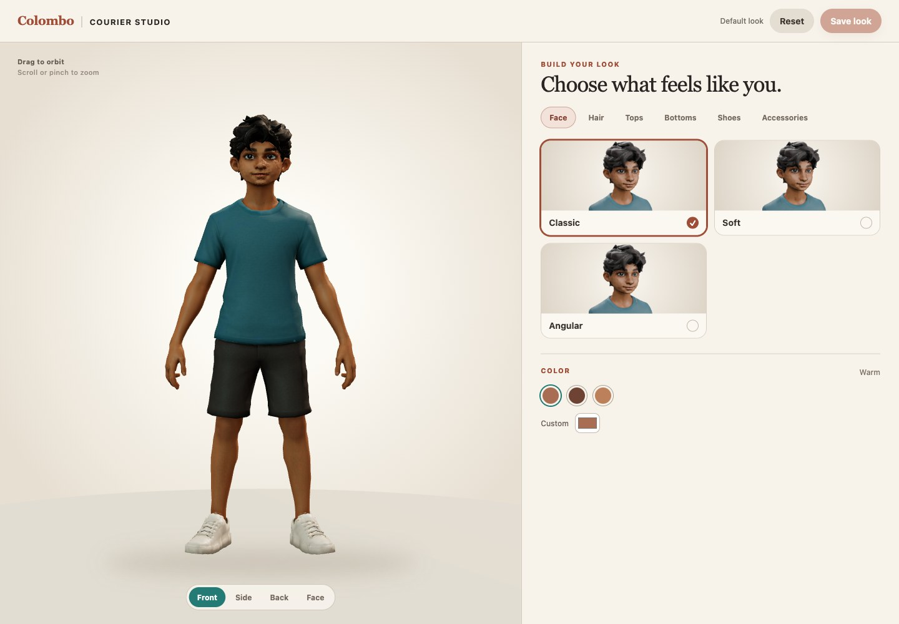
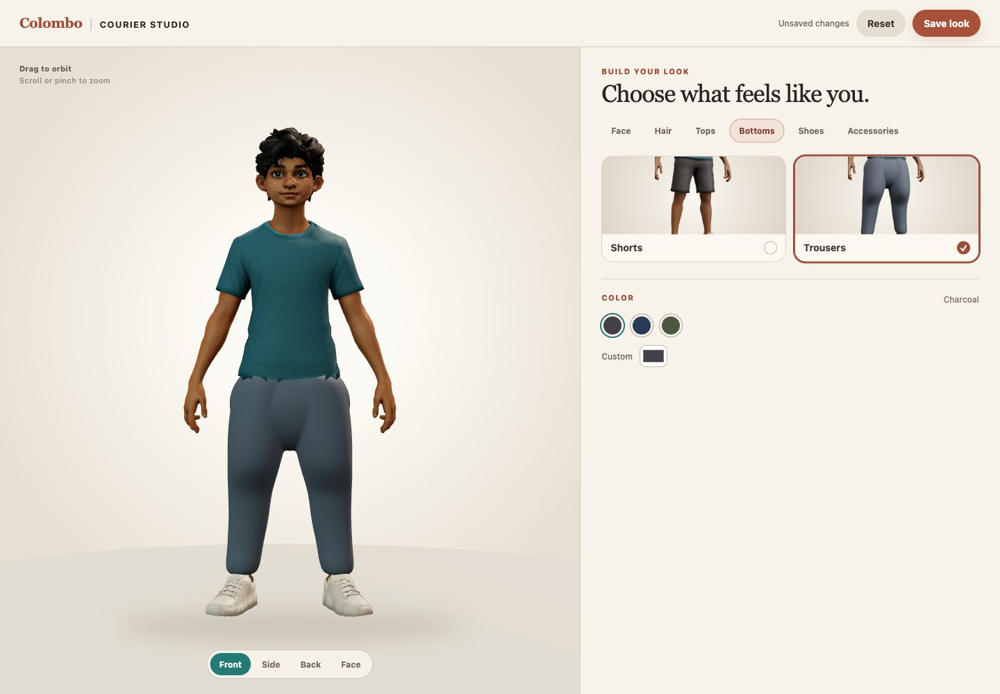

# Character customization portal

[](milestones/2026-09-13-courier-studio-desktop.jpg)

Reviewed frames: [Face color isolation](milestones/2026-09-13-courier-studio-face.jpg),
[outfit combinations](milestones/2026-09-13-courier-studio-outfit.jpg), and
[390 px mobile layout](milestones/2026-09-13-courier-studio-mobile.jpg).

## Purpose and current scope

The Courier Studio at `character-customizer.html` is a focused browser review surface for assembling a
teenage courier look from the project's starter catalog. It is designed around
the selected working character identity while allowing a face profile, hair,
clothing, shoes, accessories, and colors to change. This first catalog is a
review candidate. It has not yet been approved as the final wardrobe or been
connected to the playable bicycle rider.

The starter contract provides 21 choices: three faces, three hairstyles, three tops, two
bottoms, three pairs of shoes, two styles of sunglasses, one necklace, and one
watch, plus three independent **None** choices. Eighteen choices have visible
geometry. Tops, bottoms, and shoes always have a selection. Sunglasses, necklace,
and watch each have an independent **None** choice. Item names are generic and
carry no brand or product affiliation.

Skin, hair, top, bottom, and shoe colors each provide a small named palette and
an exact six-digit hexadecimal color input. Custom colors are appearance data;
they do not create new catalog equipment or alter the source textures.

The portal provides Front, Face, Side, and Back framing plus orbit and zoom.
Its responsive split layout stacks the viewer and controls on narrow screens.

## Catalog and asset contract

`src/customizer/catalog.ts` is the compile-time registry for slot IDs, display
labels, categories, optional slots, and color palettes. The asset manifest is
the runtime availability source. Each manifest slot supplies a default and an
item list with an ID, label, and optional thumbnail:

```json
{
  "customization": {
    "previewReady": true,
    "rigReady": false,
    "gameReady": false,
    "slots": {
      "hair": {
        "default": "wavy",
        "items": [{ "id": "wavy", "label": "Wavy", "thumbnail": "..." }]
      }
    }
  }
}
```

The browser accepts the manifest only when `previewReady` is true, every
required slot is present, each ID belongs to the known catalog, and each slot's
default is available. Optional slots must include `none`. `rigReady` and
`gameReady` are separate claims; preview geometry does not become ride-ready
because it appears in this portal.

The asset hierarchy uses `Slot_<slot>` roots and `Item_<slot>_<id>` item roots.
`Anchor_Eyes`, `Anchor_Neck`, and `Anchor_Wrist_L` are alignment-reference
empties; current accessory geometry lives under its `Item_*` root rather than
attaching dynamically at runtime. Choosing `none` hides the corresponding accessory slot. These names keep the manifest,
viewer, and future runtime loader aligned without treating filenames as UI
state.

The initial accepted starter snapshot was 6,453,452 bytes with 84 nodes, 54 meshes, 71
primitives, 12 materials, 16 textures across four embedded images, 83,658
exported vertex instances, and 60,303 triangles. Its SHA-256 is
`3ae02ff97a39f77da73b4a35759b9ea9de1e1e8cdd38071b3555dd783eccfd60`.
The manifest supplies 21 transparent RGBA thumbnails. These are static portal
metrics and do not describe the separate rig-review asset.

## Saved look contract

`src/customizer/appearance.ts` owns the versioned `CharacterAppearanceV1`
record and stores an explicitly saved look at
`colombo-delivery:character-look`. It records one item per slot plus normalized
`#RRGGBB` values for the five color regions. Unknown versions, unknown or
currently unavailable items, partial records, malformed colors, malformed
JSON, and unavailable browser storage all return a valid catalog fallback.
Saving and resetting report failure to the caller instead of hiding it.

Live edits remain draft state until **Save look** succeeds. **Reset** restores
the draft to defaults that are actually present in the loaded manifest; saving
that reset look makes it persistent. Dirty state is a field-by-field comparison of the canonical slots
and colors, independent of object property order. Delivery progress uses its
existing separate storage record.

## Source-preserving color

Every avatar clones its materials before applying a look. The source atlas uses
the approved embedded RGB mask across all mapped materials: red identifies skin
while excluding eyes, brows, lips, and hair; green identifies the top; blue
identifies shoes. The shader changes hue and saturation, retains local texture
light and dark detail, and scales value for the selected tone. Hair and bottoms use item ancestry because those interchangeable
meshes are semantically separated. Solid-color trim follows its owning clothing
region, while accessory metals keep their authored finish. The shared authored
palette values disable tint entirely, so the default reproduces the source.

Browser comparison of the authored and Auburn-hair Face view found exactly zero
pixel change in the measured left iris, right iris, mouth, cheeks, and shirt,
while the front hair fringe changed visibly. This check caught and corrected an
earlier split that had grouped disconnected iris triangles with hair. It is a
focused color-isolation check, not a complete art acceptance of every catalog
combination.

Runtime review also exercised all 21 choices. Every mandatory slot showed
exactly one item, every `none` accessory showed zero, and an invalid hair ID
left the current Quiff selection intact. Two simultaneous avatars shared no
material UUIDs; changing one look did not affect the other, and disposing the
first cleared its model and bindings without disturbing the second.

## Rebuild and extend the catalog

The final editable source is
[`teen_courier_customization.blend`](../art/characters/teen-courier/teen_courier_customization.blend).
The browser asset is
[`teen_courier_customization.glb`](../public/models/teen_courier_customization.glb),
and the neutral overview is the
[`customization contact sheet`](../public/models/teen_courier_customization_contactsheet.png).
The rebuild uses the preserved local reconstruction and makes no service call:

```sh
blender --background --python art/characters/teen-courier/split_approved_teen.py
blender --background --python art/characters/teen-courier/generate_customization_catalog.py
npm test
npm run build
npm run dev
```

Open `http://localhost:5173/character-customizer.html` for interactive review.
To add an item, first add its generic ID and label to `catalog.ts`; author a
nonempty `Item_<slot>_<id>` root under the matching `Slot_<slot>` hierarchy;
add its manifest entry and thumbnail; then rerun the generator, asset contract
tests, production build, and browser framing, switching, color, save/reset, and
mobile checks. A visible static item remains preview-ready until separate rig
and game checks justify stronger manifest flags.

## Review boundaries

The portal was checked at desktop and narrow mobile sizes for complete
framing, readable controls, independent accessory choices, exact save/reload,
reset, malformed records, blocked storage, and missing or incompatible
manifests. The actual asset contract also verifies each non-None item has mesh
triangles, every declared thumbnail exists, and the mask resolves to an embedded
image. Every visible selection must correspond to a loaded item; unavailable
equipment must not remain as a selectable shell.

Production checks at 1440 × 1000 and 390 × 844 found no horizontal overflow,
JavaScript exceptions, or scoped console errors. A complete appearance survived
Save and reload; accessories could be removed independently; draft Reset left
the saved record intact. Corrupt JSON showed the default look, blocked storage
showed **Saving unavailable** and surfaced save failure, and a missing manifest
hid the catalog behind its retry state. The existing game still loaded its
vehicle and scenery without errors. All 39 tests and the production build pass.

This milestone does not add multiplayer, accounts, an inventory economy, an
asset uploader, interchangeable garment simulation, facial blend shapes, or a
game-ready rig. The reconstructed teenage courier and its rig-review artifact
remain separate review stages. Publication of the Tripo-derived reconstruction
also remains pending confirmation of the applicable account terms.

An early catalog experiment replaced the approved courier silhouette with a
primitive head and body and was rejected before acceptance. The catalog asset
must segment and extend the reviewed teenage courier mesh, UVs, and authored
surface maps. Adding interchangeable choices does not justify replacing the
character identity that those choices are meant to preserve.

The replacement initially assigned hair from broad color and position guesses,
which moved iris triangles into the hair roots. Measured eye-plane guards and
an adjacency-based crown split restored the irises and complete fringe. Early
trouser fitting also treated a guessed axis as leg depth; measuring the actual
body cross-sections corrected the exposed calves. The shirt fit now uses the
source surface through a BVH-based projection, and transparent thumbnails made
silhouette and fit errors easier to see than the first opaque cards.

This is an accepted starter portal, not finished production character art.
An older shirt-hem surface remains visible, and dark shoe colors still reveal
UV-mask seams. Those need focused mesh and paint
refinement before a rigged game character can use the catalog.

### Continuous-trouser refinement

[](milestones/2026-09-13-trousers-fit-front.jpg)

Reviewed frames: [side fit and shoe cuff](milestones/2026-09-13-trousers-fit-side.jpg),
[back fit](milestones/2026-09-13-trousers-fit-back.jpg), and
[390 px mobile portal](milestones/2026-09-13-trousers-fit-mobile.jpg).

The first long-trouser variant extended overlapping pieces from the cut-short
source. Browser review exposed the construction: open upper-thigh tube lips,
knee bands and slits, and a jagged waist interrupted the intended continuous
garment. That version was rejected. The accepted replacement is one connected
garment surface from waist to ankle without open boundaries through the thigh
and knee range. Reusing and merging the source shorts and skin still produced
fragmented, cropped surfaces, so the replacement uses fitted garment volumes,
smooths them before a voxel union, and exports the resulting continuous shell.
The final review GLB is 7,967,904 bytes with 83 nodes, 53
meshes, 70 primitives, 12 materials, 16 textures across four images, 125,286
exported vertex instances, and 144,207 triangles. Its SHA-256 is
`7a2515972060d8e1011a69629196b8d6b339f14c353c4c83a65712002fe7701b`.

The first post-union skin partition reached too high and captured inner-forearm
triangles. Narrowing the partition to the measured lower body fixed the holes.
The original lower-leg skin now lives under the Shorts item and carries an
explicit source-tint opt-out. Selecting trousers hides that skin and selecting
shorts restores it. Exported-mesh checks require one geometrically welded
trouser component, waist-to-ankle coverage, no open thigh or knee edges, the
lower-skin node under Shorts only, its original `Teen_Skin` material, and an
upper bound below 0.7 m so forearms and torso cannot enter the partition.

Browser Save/reload passed with Trousers, Navy, Golden skin, and High-top
shoes. Against the previous accepted source, the front Shorts view changed six
pixels with mean RGB difference 0.00000308 and the back changed 71 pixels with
mean 0.00251 in a 696 × 932 comparison. The trouser-back upper body was
pixel-identical, with no forearm holes. Navy bottom color changed zero pixels in
the measured calf region, while Golden skin changed 3,459 pixels there with
mean RGB difference 13.508. All three shoe cuffs passed side review. These
measurements establish the focused geometry, visibility, and tint fix; they do
not make the static catalog a production rig or remove the separately recorded
shirt-hem and dark-shoe paint work.

The final 1440 × 1000 and 390 × 844 production checks reported no JavaScript or
scoped console errors and no horizontal overflow. The full suite passes all 41
tests, including the new geometry and source-skin partition contracts, and the
production build passes.

The final export enables modifier application so the GLB contains the reviewed
Subdivision and bevel result rather than a more angular base cage. Visual proof
from Blender is only useful when the browser export bakes the same evaluated
geometry.

Side review then showed that the first glasses and necklace used guessed depth
values and floated ahead of the real eye and shirt surfaces. Their final fit
uses measured eye depth and source-surface projection. The
[`accessory side proof`](../public/models/teen_courier_customization_accessories_side.png)
records that alignment; the anchors remain references rather than a dynamic
attachment system.
