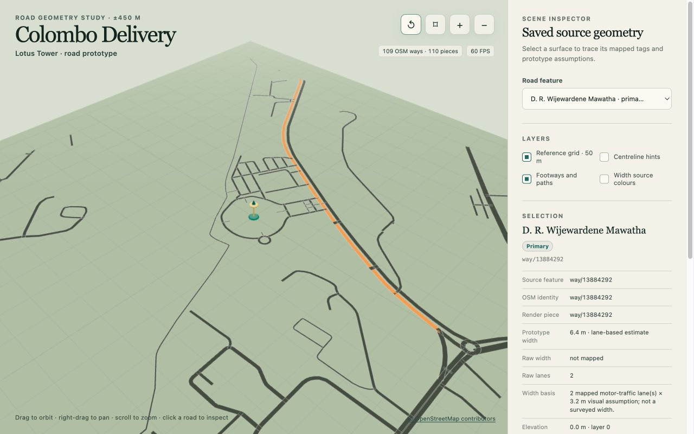

# First 3D Road Prototype

## Purpose and status

This prototype is the first browser-rendered road scene for Colombo Delivery.
It turns a bounded part of the committed Lotus Tower road audit into inspectable
Three.js meshes. It validates the source-to-local coordinate conversion,
clipping, width rules, basic vertical separation, and source traceability before
vehicle controls or delivery gameplay are added.

The scene is a technical prototype rather than a playable game. Road widths and
vertical positions are rendering assumptions where the saved OpenStreetMap
snapshot does not contain enough evidence. They are not claims about current or
surveyed street conditions.

## Production preview



*The 1280 × 800 production build with D. R. Wijewardene Mawatha selected. The
inspector shows its two mapped lanes and the resulting provisional 6.4 m visual
width.*

## Reproduce the scene

The supported toolchain is Node.js 24 or newer and npm 11 or newer. Install the
locked dependencies, then start the local server:

```sh
npm ci
npm run dev -- --host 127.0.0.1 --port 5173
```

Open [http://127.0.0.1:5173/](http://127.0.0.1:5173/). The production build and
automated checks use:

```sh
npm run typecheck
npm test
npm run build
npm run preview -- --host 127.0.0.1 --port 5174
```

After building, the last command serves the production output at
[http://127.0.0.1:5174/](http://127.0.0.1:5174/).

`npm run dev`, `npm test`, and `npm run build` read the committed artifacts in
this repository. They do not refresh OpenStreetMap. A live data refresh remains
a separate, intentional Stage 1 operation described in the
[map-data audit](MAP_DATA_AUDIT.md).

## Source and scope

The input is `data/derived/road_network.geojson`, generated from the preserved
OpenStreetMap snapshot dated **2026-09-10 23:11:10 UTC**. Its compressed source
SHA-256 is
`35ae3d3b68c95215ad1caf928ee8f9278a6b564ac4e8d7a1c539c681256f5a96`.
The manifest at `data/osm/manifest.json` is the authoritative provenance record.
The road builder validates the input's saved projection origin and Earth radius,
and carries its saved snapshot hash into the slice summary. The automated test
pins that hash to the value above. The builder does not recompute the source
file hash.

The prototype clips road centrelines to a **900 m × 900 m** square centred on
the OSM Lotus Tower anchor at longitude **79.8583149**, latitude **6.9270265**.
Its exact local bounds are −450 m to +450 m on both horizontal axes. This square
is a small engineering slice inside the Stage 1 audit area; it does not redefine
the audit's 1,000 m circular core or imply that the whole first playable area is
rendered.

The inverse-projected corner coordinates are:

| Corner | Longitude | Latitude |
| --- | ---: | ---: |
| Northwest (`x = −450`, `z = −450`) | 79.85423816576277 | 6.9310734242692895 |
| Northeast (`x = +450`, `z = −450`) | 79.86239163423724 | 6.9310734242692895 |
| Southwest (`x = −450`, `z = +450`) | 79.85423823572926 | 6.922979541002797 |
| Southeast (`x = +450`, `z = +450`) | 79.86239156427074 | 6.922979541002797 |

Every rendered piece retains its source GeoJSON feature identifier, OSM way
identifier, complete source WGS84 centreline, clipped local centreline, tags,
width rationale, and vertical-placement rationale.

The input contains 2,045 source features. Four construction or proposed
lifecycle ways are excluded, leaving 2,041 eligible ways. Of those, 109 source
ways intersect the square and produce 110 render pieces; one source way leaves
and re-enters the square. Their clipped centrelines total **11,740.633 m**.
The selected ways comprise 55 service, 18 residential, 16 footway, seven
primary, five steps, three primary-link, three secondary, one tertiary, and one
living-street way. Other `highway=*` classes in the saved road layer remain
eligible, including paths and pedestrian ways. Inclusion is geometric and does
not establish current bicycle access, route legality, surface quality, stopping
suitability, or safety.

## Coordinates and geometry

Source longitude and latitude remain authoritative. The runtime uses the same
spherical azimuthal-equidistant calculation, origin, and Earth radius
(6,371,008.8 m) recorded by the audit. In the Three.js scene:

- `x` increases east;
- `z` increases south, so north is `−z`; and
- `y` is display elevation in metres.

One scene unit equals one metre. Segment endpoints that cross the square are
clipped at the boundary and converted back to WGS84 so their source and local
coordinates remain inspectable. Road surfaces are generated as ribbon meshes
around the clipped centrelines and constrained to the same 900 m square. Joins
use mitres capped at 2.5 times the half-width, and the generated triangles face
upward.

## Width and elevation assumptions

Width is resolved in this order:

1. A strict numeric OSM `width` value in metres, decimal feet, or feet and inches
   is accepted when it converts to 0.8–40 m. Ranges and compound values are
   rejected.
2. A whole-number OSM `lanes` value from 1–12 uses **3.2 m per lane**.
3. A documented visual fallback uses the OSM `highway` class.

Lane counts are used only for motor-road classes; footways, paths, cycleways,
steps, corridors, pedestrian ways, and platforms keep class fallbacks even if a
lane-like tag is present. The fallback table is:

| OSM `highway` class | Width | OSM `highway` class | Width |
| --- | ---: | --- | ---: |
| motorway | 10.5 m | motorway link | 7 m |
| trunk | 9 m | trunk link | 7 m |
| primary | 8 m | primary link | 6.5 m |
| secondary | 7 m | secondary link | 6 m |
| tertiary | 6.5 m | tertiary link | 5.5 m |
| residential / unclassified / road | 5.5 m | living street | 4.5 m |
| service / pedestrian | 4 m | busway | 6 m |
| cycleway | 2.5 m | footway / path | 2 m |
| steps / corridor | 1.8 m | track / platform | 3 m |
| unknown class | 4 m | | |

Among the 109 intersecting source ways, one uses a strict mapped width, 11 use
lane-derived widths, and 97 use class fallbacks. The mapped case is Trace Lane,
OSM way 376563405, with `width=10`. These values make the prototype legible;
lane-derived and class-derived widths are not surveyed street dimensions.

Ground-level ways are displayed at `y = 0`. A valid OSM `layer` from −5 to +5
is displayed at **5 m per layer**. A bridge or tunnel without a valid layer is
provisionally displayed at layer +1 or −1. One rendered road is elevated:
Kovil Street, OSM way 228885183, is a mapped layer-1 bridge displayed at 5 m.
The prototype does not model bridge ramps, tunnel portals, terrain, or surveyed
elevations, so elevated pieces can appear disconnected from their approaches.

## Inspecting the scene

The screen is titled **Colombo Delivery** with the subtitle **Lotus Tower · road
prototype**. Drag to orbit, right-drag to pan, scroll to zoom, or use the reset,
top-view, zoom-in, and zoom-out buttons. Selecting a road on the map or in the
feature list opens its source identifier, name and class, width source and
rationale, raw width and lane tags, vertical placement, representative WGS84
coordinate, and local metre coordinate. The grid,
centreline hints, footways and paths, and width-source colours can be toggled
independently. The scene also reports measured frame rate, marks the Lotus Tower
origin, and keeps OpenStreetMap attribution visible.

## Validation and limits

Nine generator tests cover projection and inverse-projection agreement, clipping
at all four bounds, lifecycle exclusions, width precedence and fallbacks,
vertical placement, ribbon bounds, source traceability, and deterministic slice
totals. A 100 m east or south projection round-trips within 0.000001 m, and a
saved WGS84 sample round-trips within 0.0000000001 degrees. The projected
centreline total differs from an independent calculation by about 0.00000003 m.
All nine TypeScript road-model tests and all 12 existing Python audit tests pass.
Strict TypeScript checking and the production build also pass. The build emits
local hashed assets, including the saved GeoJSON, and makes no CDN or live OSM
request. Its 575.45 KB minified JavaScript chunk is 147.33 KB gzip and triggers
Vite's default 500 KB advisory; the saved 2.88 MB GeoJSON is a separate asset. A
performance budget and code-splitting plan have not yet been set.

The production build was reviewed in Chromium at 1280 × 800 and 390 × 844.
Orbit, right-drag pan, wheel and button zoom, top and reset views,
direct road selection, list selection with camera focus, hidden-path reveal,
and every layer toggle worked. The mobile layout had no horizontal overflow and
the inspector scrolled independently. Trace Lane showed its mapped 10 m width,
D. R. Wijewardene Mawatha showed two lanes and a provisional 6.4 m width, and
the Kovil Street bridge showed mapped layer 1 at a provisional 5 m. The browser
console contained no warnings or errors. The observed 60 FPS is one result from
this test environment, not a broader hardware guarantee.

This milestone has no bicycle, driving physics, collision surfaces, traffic,
routing, delivery loop, buildings, water, terrain, Blender-authored assets, or
authored 3D landmark. The Lotus Tower is an origin marker rather than a landmark
model. Intersecting road ribbons currently overlap; junctions are not joined
into authored intersection surfaces, collision geometry, or routable topology.
The next bounded slice adds a controllable bicycle only after this coordinate
and road-geometry result has been reviewed.
