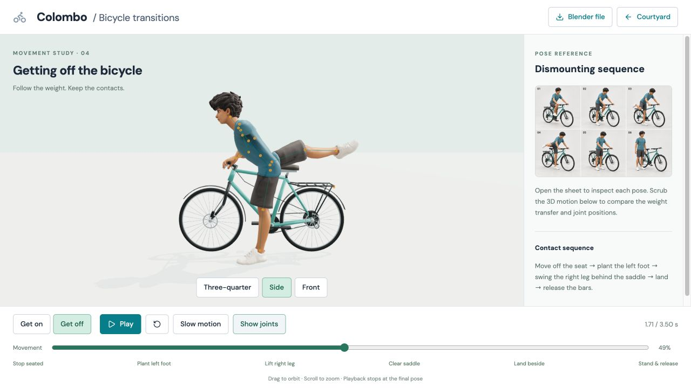

# Bicycle leg correction — 15 September 2026

Actual browser captures from `http://127.0.0.1:5175/transitions.html`, at
1280 × 720. The numbering preserves the pose order for a visual timeline.
The reference illustrations remain unchanged; the 3D animation is the revised
Blender export. Earlier milestone images are retained in the adjacent folders.

| Files | Movement / inspection |
| --- | --- |
| 01–06 | Get off: seated, left support, right lift, rear sweep, landing, upright |
| 07–12 | Get on: beside, left support, rear sweep, straddle, taking the seat, riding |
| 13 | Exit sweep from the side, with joint overlay |
| 14 | Exit sweep from the front, with joint overlay |
| 15 | Courtyard after completing the updated mount and exit |

See [the motion notes](../../../cyclist/TRANSITIONS.md) for the corrected hinge,
knee extension, foot placement and validation scope.

