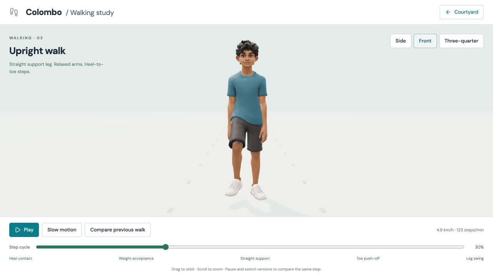
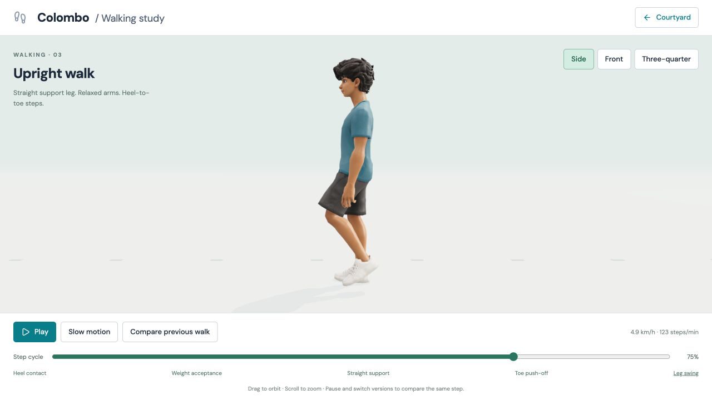
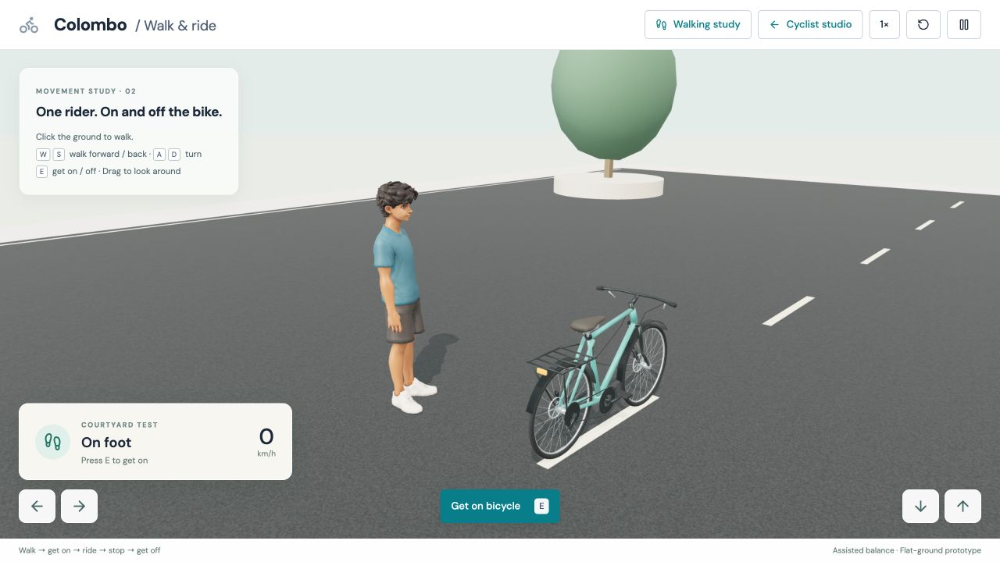
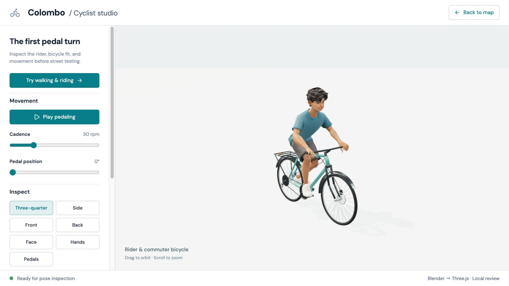
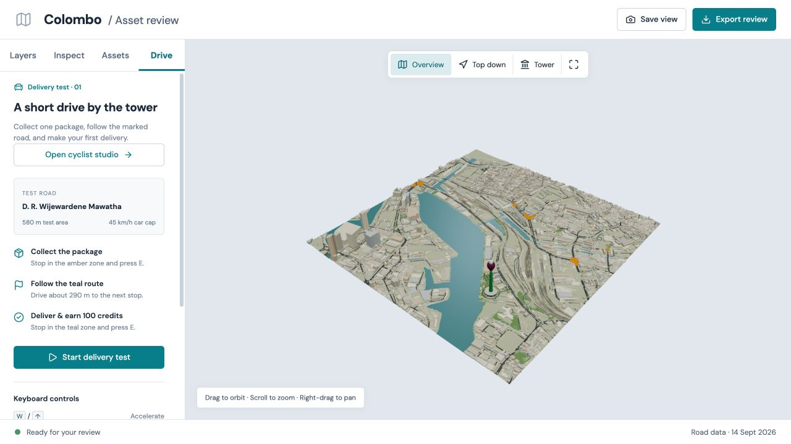
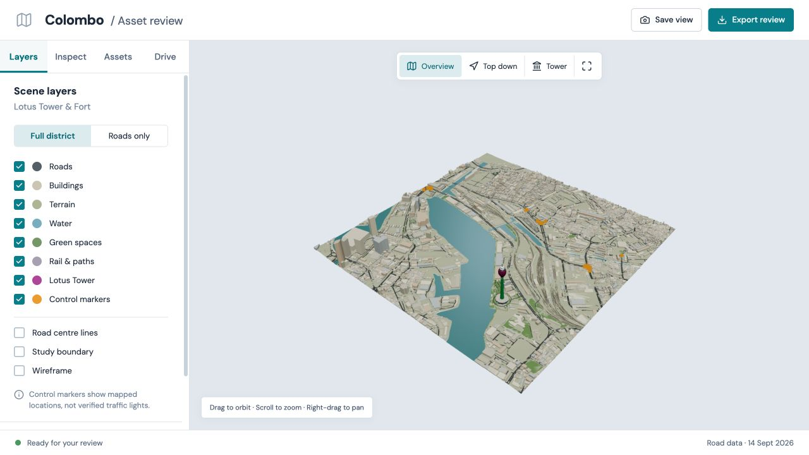

# Approved walking — 15 September 2026

Browser screenshots of source commit `705a404`, before the next mounting and
dismounting pass. All captures are 1280 × 720 PNGs. The approved walking asset,
Blender source, 28 passing tests and validation report are preserved in that commit.

1. **Walking / side / straight support / 30%** — `/walking.html`
   
2. **Walking / front / straight support / 30%** — `/walking.html`
   
3. **Walking / side / swing / 75%** — `/walking.html`
   
4. **Courtyard / on foot** — `/movement.html`
   
5. **Cyclist studio / seated pose** — `/cyclist.html`
   
6. **Delivery preview** — `/#drive`
   
7. **Map review / layers** — main viewer, Layers tab
   
