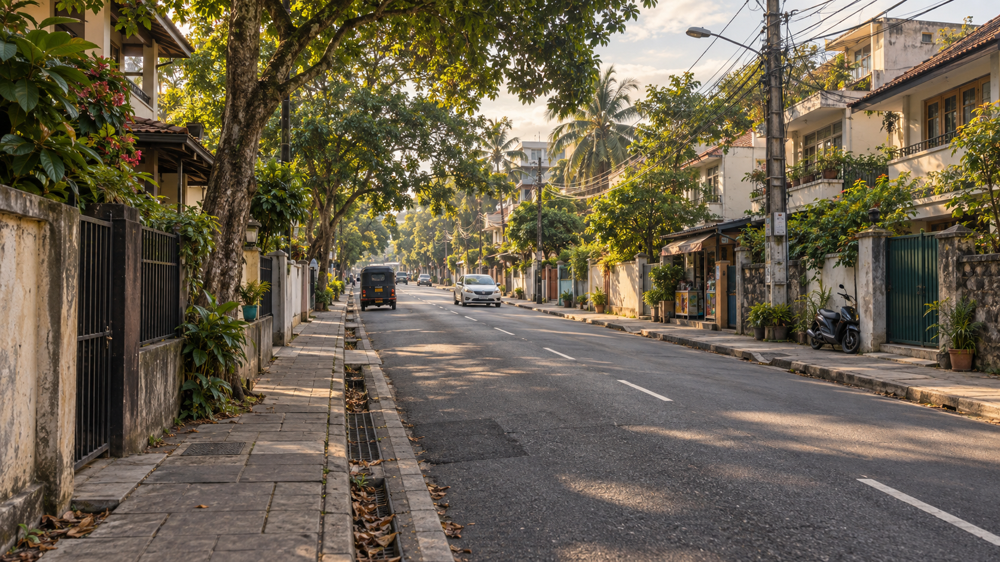
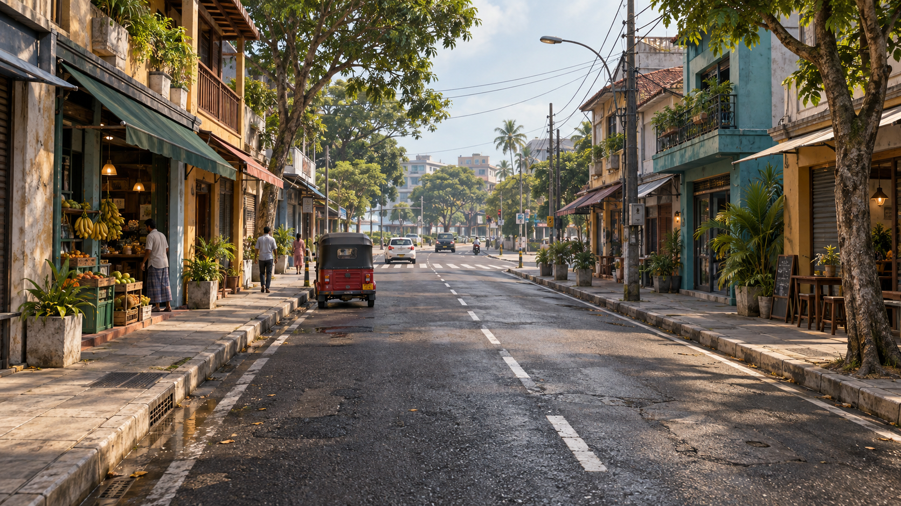
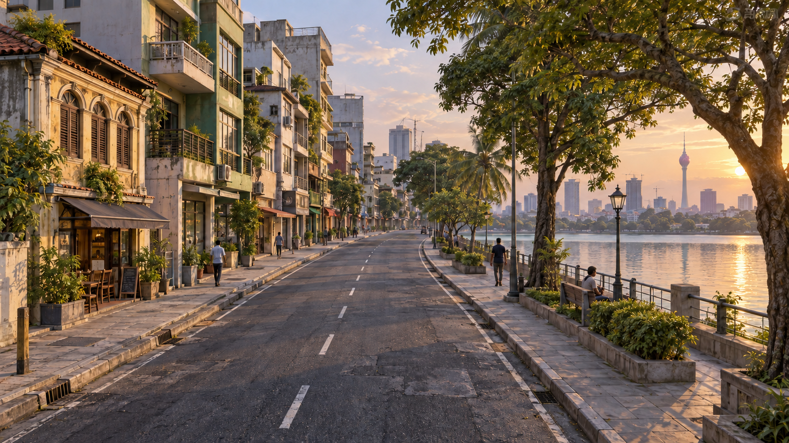

# Colombo street concepts — 15 September 2026

Status: visual directions for selection. No direction has been approved for 3D
production yet.

Review of the first street pass requested a more believable environment before
further modeling. These imagined Colombo-inspired streets explore the complete
composition: road surfaces, pavements, drainage, trees, building variety,
setbacks, and everyday street details. They are concept artwork rather than
screenshots of the running game or reconstructions of specific streets.

## A — Green neighborhood

A quieter residential route with mature shade trees, garden walls, gates,
verandas, and occasional small shops. Warm afternoon light and irregular
planting make the street feel settled and lived-in.

[Full art brief](a-art-brief.md)

## B — Neighborhood shops

A compact commercial route with varied shop-houses, awnings, balconies,
produce stalls, pedestrians, and weathered materials. Continuous pavements
and clear curb edges connect the different frontages.

[Full art brief](b-art-brief.md)

## C — Lakeside street

A more open route with mixed buildings on the inland side and a shaded civic
promenade beside the lake. The distant Lotus Tower provides a recognizable
landmark. Warm evening light gives this direction a distinct mood.

[Full art brief](c-art-brief.md)

## Selection and next checkpoint

Select A, B, C, or a combination of their elements. The selected image will guide
one short 3D street section first: proportions and layout, pavement and curb
kit, building families, trees and street props, then materials and lighting.
That section returns for human review before expanding the district.

Image-level details such as apparent road widths, individual traffic poses,
markings, and exact landmark placement still need to be resolved against the
game's road data and left-hand traffic rules during 3D implementation.
